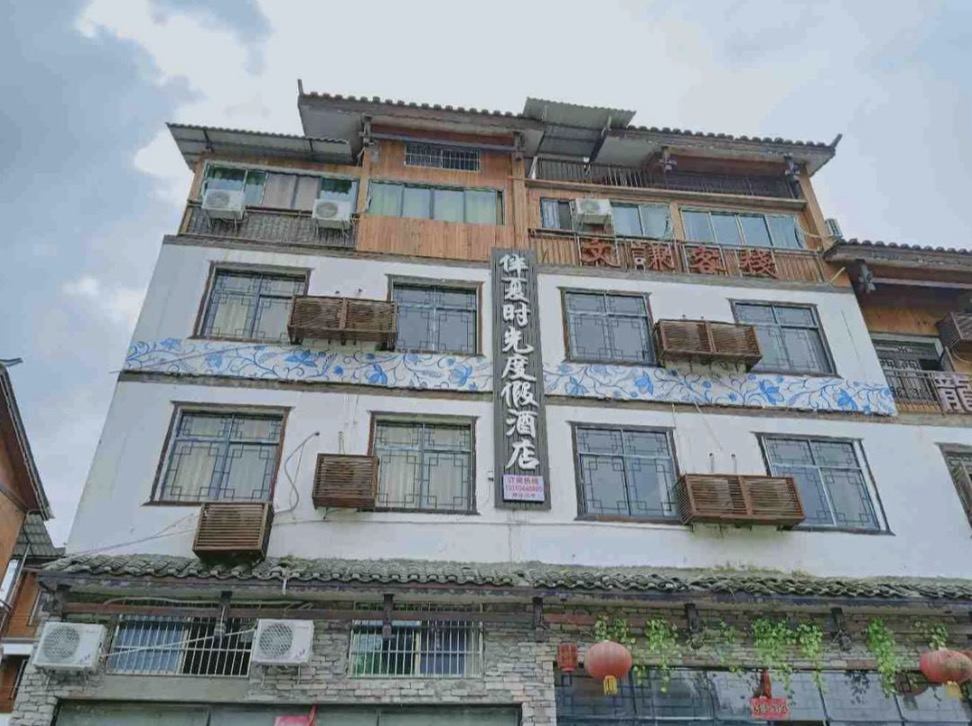
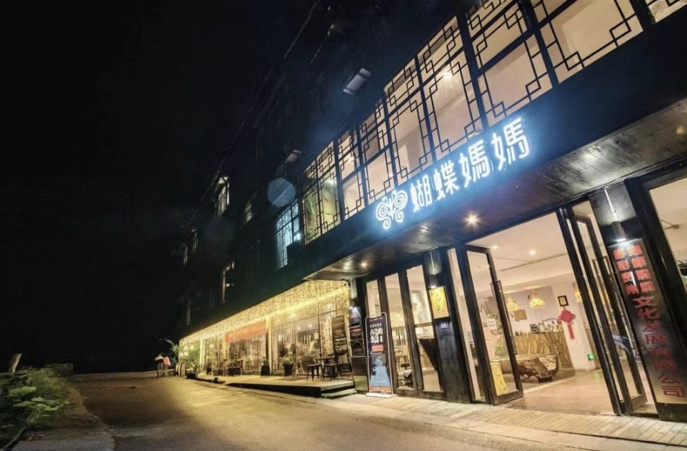

#
小码农与小🐼的五一之行❤️详细规划

4月30日：
---

* 准备：
	* 携带物件：
		* 手机📱、电脑💻、手柄🎮、带win系统的U盘💾、两人能玩的有趣APP 
		* 身份证
		* 零食🍱、水🥤
		* 衣物👔👖、防滑运动鞋👟、拖鞋🩴
		* 洗漱用品🪥、发胶、吹风机、剃须刀🪒、彩妆物品💄
		* 防晒霜🧴、肠胃药💊、创口贴、口罩😷、眼罩、纸巾🧻、一次性杯子

   
	
5月1日：
---
* 8:30～11:41 贵阳🚘➡️ 兴仁（约267公里，3小时11分）

5月2日：

* 挖土
* 耕地
* 装系统

5月3日：
---
* 7:00～13:00 兴仁🚘➡️[小七孔](https://j.map.baidu.com/91/fSpJ)（约500公里，6小时）
* 13:00～14:20 入住休整吃饭
	* 入住酒店🏨：
		* 伴夏时光度假酒店
		* 13310448880
		* 地址：[小七孔伴夏时光度假酒店](https://j.map.baidu.com/91/fSpJ)
		* 

		* 已交订金100，需再补180，微信联系
	* 休整吃饭，询问酒店老板，周边美食🥘
* 14:30～18:00 小七孔景区游玩
	* 小七孔景区
		* 官方电话☎️：[0854-3516116]()
		* [官方微信公众号](http://mp.weixin.qq.com/mp/getmasssendmsg?__biz=MzA4MzYwMzYwNw==#wechat_webview_type=1&wechat_redirect) 
		* [门票🎫](http://lbypt.tdtk.com/wechat/index.html?t=7244&success=dHJ1ZQ==&isFollow=dHJ1ZQ==&isLeader=MA==&enCode=MTIwMA==&appID=d3g1YWQyMDRjMTIwOTQxNjJj&openid=b2x3N010eklOZzFmTG9JTjJkclVWeUVheHBPOA==&nickname=TA==&headimgurl=aHR0cHM6Ly90aGlyZHd4LnFsb2dvLmNuL21tb3Blbi92aV8zMi84a2JzUzFQNUJKSnVIVG5qVVRKaWF6VkVoeEpQQTBTUGlhNFRWSDZ3V0FKNmg1NXZ4b283OHN4MkxWR2liakwwRkNOeUlyaWJkTVJpYmFrenczdXhwQ3lRbFh3LzEzMg==#/userCenter)，包含观光车🚎及保险， <B>持身份证入园</B>[1]()，<B>入园时间限制🚫：13:30-14:30之间</B>，两日内有效，限8次
		* 注意事项⚠️：做好防晒[2]()、穿防滑运动鞋[3]()、准备拖鞋[4]()

* 18:00～20:30 吃饭休整
* 20:30～	休息

5月4日：
---
* 8:30～9:00 吃早餐
* 9:00～12:00 [小七孔](https://j.map.baidu.com/91/fSpJ)🚘➡️[西江苗寨西门停车场](https://j.map.baidu.com/91/fSpJ)（约210公里，3小时）
* 12:00～12:30	停车检票入园
	* 景区门票🎫，包含四程(出入景区、上下观景台)观光车票

* 12:30～13:00	[西江苗寨西门停车场](https://j.map.baidu.com/91/fSpJ)🚎➡️一号风雨桥
* 13:00~13:30 办理入住
	* 美团[「蝴蝶妈妈」](https://hotel.meituan.com/order/4845882750612776556/?bizType=1)
	* 

* 游玩
	* 地点
		* 拍照：有观景台、风雨桥、山上的栈道、
		* 苗族文化歌舞表演：西江博物馆。。。
	* 拦门酒，每天10：30、15:00有十二道拦门酒
	* 长桌宴，每天12：30和18:30有特色长桌宴
	* 酸汤鱼、辣子鸡、米线、豆花烤鱼、甚至各种虫子

5月5日：
---
* 继续游玩

[西江苗寨西门停车场](https://j.map.baidu.com/91/fSpJ)🚘➡️贵阳，（约195公里，3小时、适时出发）